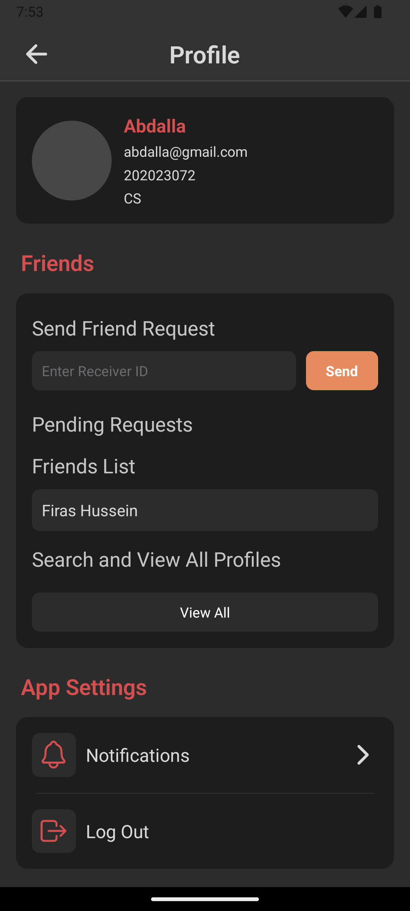

<div align="center">
  
  <br/>
  <table><tr><td width="560" align="center">
  A React Native app for campus event discovery and social coordination, replacing scattered group chats and bulletin boards with one structured platform.
  </td></tr></table>
</div>


## Overview

University students have no reliable way to know what's happening on campus. Events get announced across department boards, group chats, and club pages, and most students miss them.

Eventat gives students one place to browse, RSVP, and track events. You can see which friends are attending, follow club activity, and comment on events. The app is campus-scoped and uses real building coordinates, so location data is actually useful.


## Features

- **Event RSVP with attendance tracking**: join or leave events, see a live attendee count with profile picture previews
- **Event creation with multi-image upload**: up to 6 images uploaded to Firebase Storage; supports date/time picker, faculty location selection mapped to real coordinates, and room number
- **Personal calendar view**: joined and created events grouped by month
- **Time-based event filtering**: filter by Today, Tomorrow, This Weekend, or Upcoming without manual date entry
- **In-app event search**: live filtering by event name on the explore screen
- **Interactive campus map**: events plotted on Google Maps using building coordinates; tap a pin to open event details
- **Club directory**: browse clubs with member count, event count, and club-specific event feeds
- **Comments on events**: full CRUD comment system per event
- **Social friend system**: send, accept, and reject friend requests; view friend profiles
- **Secure token-based auth**: JWT in the OS-level secure enclave via `expo-secure-store`; auto-login on relaunch
- **Edit events**: creators can update details post-publish


## Technical Highlights

### State & Data Flow
- **Redux + Thunk** — Managed shared state across multiple domains, isolating async API logic and keeping UI components free of data-fetching concerns  
- **Axios interceptor** — Centralized JWT injection from `expo-secure-store` into all requests, removing auth handling from UI components  

### Security & Data Handling
- **Secure token storage** — Stored JWT and user data using `expo-secure-store`, leveraging OS-level encryption  
- **Firebase Storage uploads** — Implemented image upload flow with state managed outside Redux to avoid blocking UI  

### Architecture & Code Organization
- **Feature-based structure** — Organized components by feature (`Cards/`, `Headers/`, `ui/...`) rather than type for better maintainability  
- **Reusable utilities** — Extracted logic like `groupEventsByMonth` into standalone helpers  

### UX & Product Decisions
- **Structured location input** — Mapped campus buildings to fixed GPS coordinates, ensuring accurate map pins  
- **Responsive layout** — Used `useWindowDimensions()` with breakpoints to adapt across device sizes

## Architecture

The app is organized around feature ownership and separation of concerns:

- `API/action/` — Redux thunks and Axios API calls, grouped by domain
- `API/reducers/` — domain reducers for auth, events, clubs, comments, and friends
- `screens/` — full app screens such as Explore, Calendar, Create, Map, and Profile
- `components/` — reusable UI grouped by feature, such as cards, headers, auth UI, and profile UI
- `navigators/` — stack and tab navigation configuration
- `utils/` — shared helpers such as event grouping by month

Auth state determines which navigation stack mounts at the root. API calls are isolated from screen components, keeping UI code focused on rendering and interaction.


## Screenshots

<div align="center">
  <table>
    <tr>
      <td align="center"><br/><sub>Explore</sub></td>
      <td align="center"><br/><sub>Event Details</sub></td>
      <td align="center"><br/><sub>Comments</sub></td>
    </tr>
    <tr>
      <td align="center"><br/><sub>My Events</sub></td>
      <td align="center"><br/><sub>Attending (Empty)</sub></td>
      <td align="center"><br/><sub>Club List</sub></td>
    </tr>
    <tr>
      <td align="center"><br/><sub>Club Details</sub></td>
      <td align="center"><br/><sub>Settings</sub></td>
      <td></td>
    </tr>
  </table>
  <p><sub>More screenshots available in the <a href="./docs">docs/</a> folder.</sub></p>
</div>


## Tech Stack

| Layer | Technology |
|---|---|
| Framework | React Native (Expo SDK 53) |
| Language | JavaScript (React 19) |
| State Management | Redux + Redux Thunk |
| Server State | TanStack React Query (v5) |
| Navigation | React Navigation v7 (Native Stack + Bottom Tabs) |
| HTTP Client | Axios with request interceptor |
| Auth Storage | expo-secure-store (hardware-backed) |
| Image Storage | Firebase Storage |
| Maps | react-native-maps (Google Maps) |
| Date Handling | Moment.js + @react-native-community/datetimepicker |
| Backend | NestJS REST API, deployed on Vercel |


## Setup & Installation

```bash
git clone https://github.com/brullee/Eventat.git
cd eventsApp
npm install
npx expo start
```

Requires an Android emulator, iOS simulator, or Expo Go. Google Maps API key goes in `app.json` under `android.config.googleMaps.apiKey`. Firebase credentials go in `firebaseConfig.js` (gitignored).

## My Role

Primary frontend engineer responsible for the full mobile application layer.

### Architecture & Structure
- Designed the component hierarchy from scratch, separating reusable primitives (cards, headers) from feature-scoped components and full screens  
- Enforced a consistent dark theme using shared color constants  

### Navigation & App Flow
- Built conditional root navigation (auth vs. main stack) based on persisted login state  
- Configured bottom tab navigation with custom icons and styling  

### State Management & API Integration
- Implemented Redux store, domain reducers, and async thunks for all API interactions  
- Centralized API calls through Axios with an auth interceptor and per-operation loading/error handling  

### Core Features
- **Authentication** — login, signup, and auto-login using secure token storage and JWT decoding  
- **Event creation** — multi-step flow with image upload, date/time selection, and coordinate-mapped location input  
- **Map integration** — connected event coordinates to Google Maps with navigation to event details  
- **Calendar & filtering** — grouped-by-month calendar and time-based filters (Today/Tomorrow/Weekend/Upcoming)

## Notes

Built as a graduation project in collaboration with [Firas Hani](https://github.com/FirasHani), who developed the NestJS REST API ([backend repository](https://github.com/FirasHani/eventat-app-backend)).

Selected for presentation at [NTP 2025](https://www.linkedin.com/in/abdalla-wohoush/overlay/Certifications/1965221544/treasury?profileId=ACoAAA_8wJcBnBHU-kOsS35VkzfnzjahMadEobY) and awarded [2nd place](https://www.linkedin.com/in/abdalla-wohoush/overlay/Honor/2080759075/treasury/?profileId=ACoAAA_8wJcBnBHU-kOsS35VkzfnzjahMadEobY) in the university’s graduation project competition.

The frontend was integrated and tested against the deployed backend during development.
